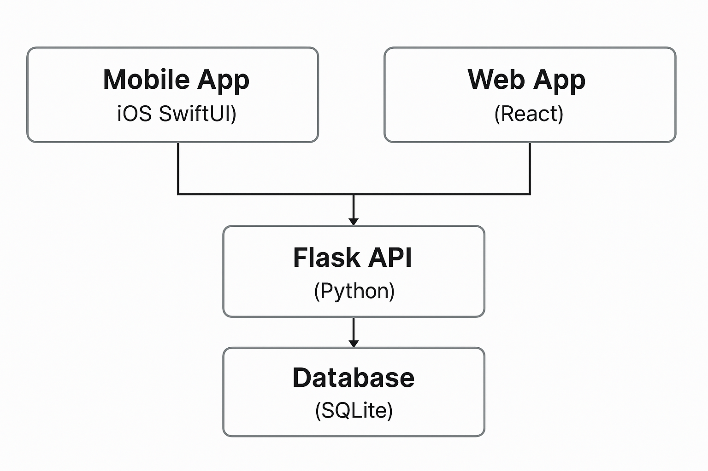
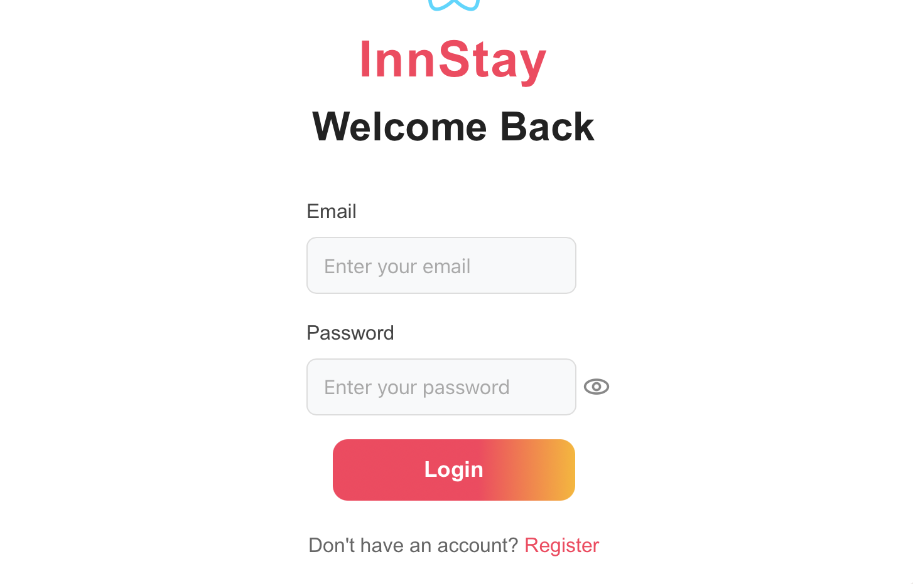

# InnStay Project Documentation

## Architecture Overview

The InnStay system consists of three main components:

- **Web App** — React + Axios
- **Mobile App** — SwiftUI + URLSession
- **Backend API** — Flask + SQLite

Below is the high-level architecture of the system:


<div align="center">
    
</div>


# InnStay — Mobile App


This is the **iOS SwiftUI mobile application** for InnStay. It allows users to:

- log in or continue as a guest
- browse available hotel rooms
- book rooms
- view and manage their reservations


The app communicates with a Flask backend via HTTP and uses JWT authentication.

## Login Page

<div align="center">
    
</div>

The login screen offers two main actions:

- **Log In**: Users can enter their email and password. After authentication, the JWT token is decoded to check the role and redirect:
  - Regular users → `ExploreView`
  - Admins → `HostPanelView`
- **Continue as Guest**: Allows navigation without a user account, but with limited booking capabilities.

---

## Register Page

<div align="center">
    
</div>

The registration screen allows new users to create an account by entering:

- First Name, Last Name
- Username
- Email
- Password

Upon successful registration, users are redirected to the room listings page.

---

## Explore Page

<div align="center">
    
</div>

This is the main screen for authenticated users or guests. It features:

- A search bar for locations
- A list of available rooms
- A **Logout** button (top-left)
- A **Profile** icon (top-right) to view reservations

Rooms are displayed in a scrollable Airbnb-like format, including an image, hotel location, nightly price, and a static rating (currently hardcoded).

---

## Booking Detail Page

<div align="center">
    
</div>

After selecting a room, users are taken to the `ListingDetailView`, which includes:

- Room information (type, price, availability)
- A date picker for check-in
- A **Reserve** button:
  - Authenticated users → submit a booking request using JWT
  - Guest users → see a popup form for entering name and email

---

## Your Bookings Page

<div align="center">
    
</div>

The `ProfileView` shows all bookings made by the logged-in user:

- Hotel name
- Room type
- Reservation period
- Status badge (Confirmed, Pending, Cancelled), each with distinct color

A close button in the top-right corner dismisses the view and returns to the main page.

---

## Architecture and Flow

- All navigation is handled by `AuthRouterView`, which switches between:
  - `LoginScreen`, `SignupScreen`
  - `ExploreView` (for users)
  - `HostPanelView` (for admins)
- All communication happens via authenticated HTTP requests (JWT stored in `UserDefaults`)
- The app uses the MVVM (Model-View-ViewModel) architecture for modularity and maintainability

---

## Running the Mobile App

To run the InnStay mobile app locally:

1. Open the project in **Xcode**.
2. Select the target device or simulator (e.g. iPhone 15 Simulator).
3. Build and run the project (`Cmd + R`).

### Requirements:

- Xcode 15+
- Swift 5.9+
- iOS 17+ simulator or real device


## Web App

This is the **React.js web application** for InnStay. It provides a fully responsive interface for:

- User registration and login
- Searching for hotels and rooms
- Viewing availability and pricing
- Booking rooms
- Viewing personal reservations

The app communicates with the Flask backend through RESTful APIs and uses JWT-based authentication.

---

## Register Page

<p align="center">
  
</p>

Users can create an account by filling in:

- Full Name
- Email
- Password
- Confirm Password

Upon successful registration, the user is redirected to the login page.

---

## Login Page

<p align="center">
  
</p>

The login screen allows users to enter:

- Email
- Password

Upon successful login:

- Regular users are redirected to the home page (`Explore Page`) with search and booking capabilities.
- The JWT token is stored in `localStorage` for authenticated requests.

---

## Explore Page (Home)

<p align="center">
  
</p>

This is the main dashboard:

- Top navigation with **Bookings**, **Reviews**, **Recommendations**
- Search bar with filters:
  - Destination
  - Check-in date
  - Check-out date
  - Room type
- List of available hotels and their prices.

Clicking on a hotel opens the detailed room selection.

---

## Booking Page

<p align="center">
  
</p>

Inside the selected hotel, users can:

- View available rooms with:
  - Room type
  - Price per night
  - Facilities
- Select dates
- See a **dynamic price summary**:
  - Room subtotal
  - Cleaning fee
  - Service fee
  - Total
- Confirm booking by clicking **Reserve**.

---

## User Reservations Page

<p align="center">
  
</p>

Under **Your Bookings**:

- Users can view their existing bookings:
  - Hotel name and location
  - Room type
  - Check-in / Check-out dates
  - Status (Confirmed, Cancelled)
  - Price per night

The navigation bar allows switching between bookings, reviews, and recommendations.

---


# InnStay — Flask Backend API

This is the **Flask REST API** that powers the InnStay platform. It handles:

- User authentication and authorization (JWT-based)
- Hotel and room data management
- Booking processing (user and guest bookings)
- Admin operations (booking approvals)
- Reviews and recommendations

---

## Running the Flask API

To run the API locally:

1. Create a virtual environment:

    ```bash
    python3 -m venv venv
    source venv/bin/activate  # on Mac/Linux
    # OR
    venv\Scripts\activate     # on Windows
    ```

2. Install dependencies:

    ```bash
    pip install -r server/requirements.txt
    ```

3. Run the Flask server:

    ```bash
    python server/app.py
    ```

The API will be available at:

http://127.0.0.1:5000

---

## Features

- **User authentication** (`/api/auth/login`, `/api/auth/register`)
- **JWT-based role authorization** (user / admin)
- **Room listings** (`/api/rooms/get_rooms`)
- **User bookings** (`/api/bookings/`)
- **Guest bookings** (`/api/bookings/guest`)
- **Admin booking management** (`/api/bookings/admin`)
- **Reviews** (`/api/reviews/`)
- **Recommendations** (`/api/recommendations/`)

---

## API Endpoints Summary

| Endpoint                            | Method | Description                          | Auth |
|-------------------------------------|--------|--------------------------------------|------|
| `/api/auth/register`                | POST   | Register new user                    | No   |
| `/api/auth/login`                   | POST   | Log in, returns JWT token            | No   |
| `/api/rooms/get_rooms`              | GET    | List all rooms                       | No   |
| `/api/bookings/`                    | GET/POST | User bookings (view or create)     | Yes  |
| `/api/bookings/my`                  | GET    | Get logged-in user's bookings        | Yes  |
| `/api/bookings/guest`               | POST   | Submit guest reservation             | No   |
| `/api/bookings/admin`               | GET    | Admin: View all bookings             | Admin|
| `/api/bookings/<booking_id>/status` | PATCH  | Admin: Update booking status         | Admin|
| `/api/reviews/`                     | GET    | List all reviews                     | No   |
| `/api/recommendations/`             | GET    | List all recommendations             | No   |

---

## Architecture and Flow

- **Framework:** Flask + SQLAlchemy + Flask-JWT-Extended
- **Database:** SQLite (for local development)
- **Authentication:** JWT token stored on client side
- **Role-based access control:** `user`, `admin`, `db_admin`
- **CORS enabled:** allows connection from mobile and web apps

Typical flow:

[Client App] → [Flask API] → [SQLite Database]

All user sessions are authenticated with JWT tokens passed in `Authorization: Bearer <token>` headers.

---

## Notes

- The API is structured in **modular Blueprints**:
    - `auth_bp`
    - `rooms_bp`
    - `bookings_bp`
    - `reviews_bp`
    - `recommendations_bp`
- All models are defined in `models.py`
- Admin role users can manage bookings through `/api/bookings/admin`


Understood!
Here is the complete clean Markdown, in the same format as your example (with correct bash blocks, separators, consistent):

⸻


## Running the Project

This section describes how to install and run the entire InnStay system locally.

The project consists of:

1. **Backend** — Flask API  
2. **Mobile App** — iOS SwiftUI App  
3. **Web App** — React App

---

### Prerequisites

- **Python 3.10+**
- **Node.js 18+** and **npm**
- **Xcode 15+** (for building and running the iOS app)
- **SQLite** (already included with Python)

---

### 1. Running the Flask Backend

#### Install dependencies

```bash
cd InnStay
python3 -m venv venv
source venv/bin/activate
pip3 install -r server/requirements.txt
```
#### Run the Flask server

```bash
python3 server/app.py
```
The API will be available at:

```
http://127.0.0.1:5000
```

### 2. Running the React Web App

#### Install dependencies

```bash
cd frontend/code-parrot
npm install
```

#### Start the development server

```bash
npm run dev
```

The web app will be available at:

```
http://localhost:5173
```

### 3. Running the iOS SwiftUI App

#### Open the project in Xcode

```bash
InnStay/InnStay.xcodeproj
```